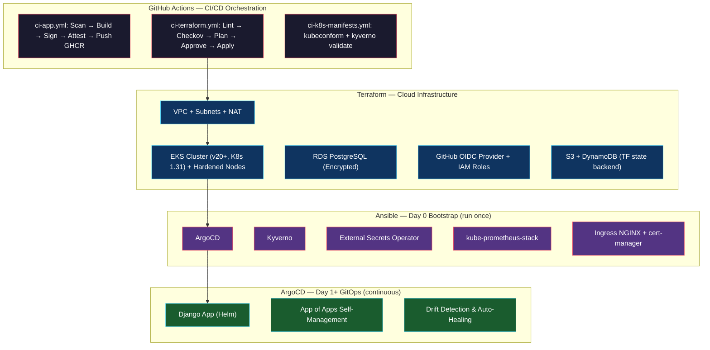

# DevSecOps Well-Architected Platform & Provisioning Pipeline

[](https://github.com/h1zardian/devsecops-platform-provisioning-pipeline/actions)
[](https://slsa.dev)
[](LICENSE)

A production-grade, well-architected DevSecOps platform demonstrating end-to-end supply-chain security (SLSA Level 3), automated Infrastructure-as-Code (IaC) security scanning, Day 0 Ansible platform bootstrapping, Day 1+ GitOps continuous delivery via ArgoCD, Kyverno runtime admission controls, zero-trust secrets management with External Secrets Operator (ESO), and Prometheus/Grafana observability.

---

## Architecture Overview



---

## Key Security Features

* **Supply Chain Security (SLSA Level 3)**:
  * Secret scanning (`gitleaks`), Python SAST (`bandit`), container vulnerability scanning (`trivy`).
  * Software Bill of Materials (`syft` CycloneDX) attached to image manifests.
  * Keyless image and SBOM signatures (`cosign`) verified against GitHub Actions OIDC identity.
  * Signed build attestations via `slsa-github-generator`.
* **Zero-Trust Infrastructure & Secret Management**:
  * AWS authentication via GitHub Actions OIDC Federation (zero static AWS keys).
  * AWS Secrets Manager integrated with Kubernetes via External Secrets Operator (ESO).
  * Enforced IMDSv2 (`http_tokens = required`), EBS volume encryption, and EKS secrets KMS envelope encryption.
* **GitOps & Admission Control**:
  * Continuous delivery powered by ArgoCD with automated drift detection and self-healing.
  * Kyverno policy enforcement at admission: disallows `:latest` tags, enforces non-root containers, mandates resource limits, and validates Cosign keyless signatures.
  * Safe database migrations using Helm `pre-install,pre-upgrade` hook `Job`.
* **Observability & SRE Controls**:
  * Application metric exposition via `django-prometheus` at `/metrics`.
  * Prometheus `ServiceMonitor` and `PrometheusRule` alerting on error rates (>5%) and pod crashloops.
  * Pre-configured Grafana dashboard for app latencies, request rates, and resource utilization.

---

## Quick Start & Deployment Guide

### Prerequisites
* AWS CLI configured, Terraform >= 1.5, Ansible >= 2.15, Helm >= 3.12, kubectl, Docker.

### 1. Initialize State Backend
```bash
make init-state
```

### 2. Provision Infrastructure
```bash
make cluster-up
```

### 3. Bootstrap Day 0 Platform Controllers
```bash
aws eks update-kubeconfig --name devsecops-eks-cluster --region us-east-1
make ansible-bootstrap
```

### 4. Continuous GitOps Delivery
ArgoCD automatically detects changes in `k8s/apps/django-app/values.yaml` and deploys the application.

---

## Cost Optimization
* **On-Demand AWS Spend**: Use `make cluster-down` to destroy infrastructure when not demonstrating or testing (~$150/month active vs <$10/month on-demand).
* **Zero-Cost Local Iteration**: Run `make dev-up` to launch local Docker Compose stack for offline development.
