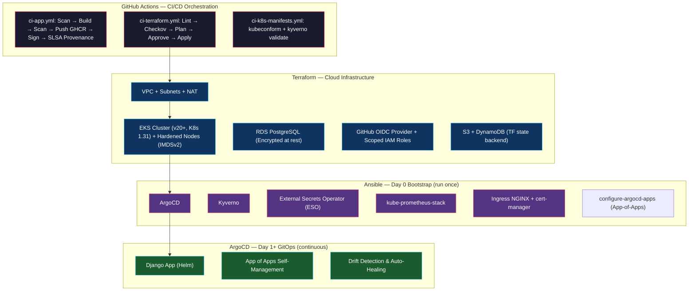

# Architecture Blueprint & System Boundaries

```mermaid
graph TD
    subgraph "GitHub Actions — CI/CD Orchestration"
        A1["ci-app.yml: Scan → Build → Scan → Push GHCR → Sign → SLSA Provenance"]
        A2["ci-terraform.yml: Lint → Checkov → Plan → Approve → Apply"]
        A3["ci-k8s-manifests.yml: kubeconform + kyverno validate"]
    end

    subgraph "Terraform — Cloud Infrastructure"
        T1["VPC + Subnets + NAT"]
        T2["EKS Cluster (v20+, K8s 1.31) + Hardened Nodes (IMDSv2)"]
        T3["RDS PostgreSQL (Encrypted at rest)"]
        T4["GitHub OIDC Provider + Scoped IAM Roles"]
        T5["S3 + DynamoDB (TF state backend)"]
    end

    subgraph "Ansible — Day 0 Bootstrap (run once)"
        B1["ArgoCD"]
        B2["Kyverno"]
        B3["External Secrets Operator (ESO)"]
        B4["kube-prometheus-stack"]
        B5["Ingress NGINX + cert-manager"]
        B6["configure-argocd-apps (App-of-Apps)"]
    end

    subgraph "ArgoCD — Day 1+ GitOps (continuous)"
        G1["Django App (Helm)"]
        G2["App of Apps Self-Management"]
        G3["Drift Detection & Auto-Healing"]
    end

    A2 --> T1 --> T2
    T2 --> B1
    B1 --> G1

    style A1 fill:#1a1a2e,stroke:#e94560,color:#fff
    style A2 fill:#1a1a2e,stroke:#e94560,color:#fff
    style A3 fill:#1a1a2e,stroke:#e94560,color:#fff
    style T1 fill:#0f3460,stroke:#53d8fb,color:#fff
    style T2 fill:#0f3460,stroke:#53d8fb,color:#fff
    style T3 fill:#0f3460,stroke:#53d8fb,color:#fff
    style T4 fill:#0f3460,stroke:#53d8fb,color:#fff
    style T5 fill:#0f3460,stroke:#53d8fb,color:#fff
    style B1 fill:#533483,stroke:#e94560,color:#fff
    style B2 fill:#533483,stroke:#e94560,color:#fff
    style B3 fill:#533483,stroke:#e94560,color:#fff
    style B4 fill:#533483,stroke:#e94560,color:#fff
    style B5 fill:#533483,stroke:#e94560,color:#fff
    style G1 fill:#1a5c2e,stroke:#53d8fb,color:#fff
    style G2 fill:#1a5c2e,stroke:#53d8fb,color:#fff
    style G3 fill:#1a5c2e,stroke:#53d8fb,color:#fff
```
